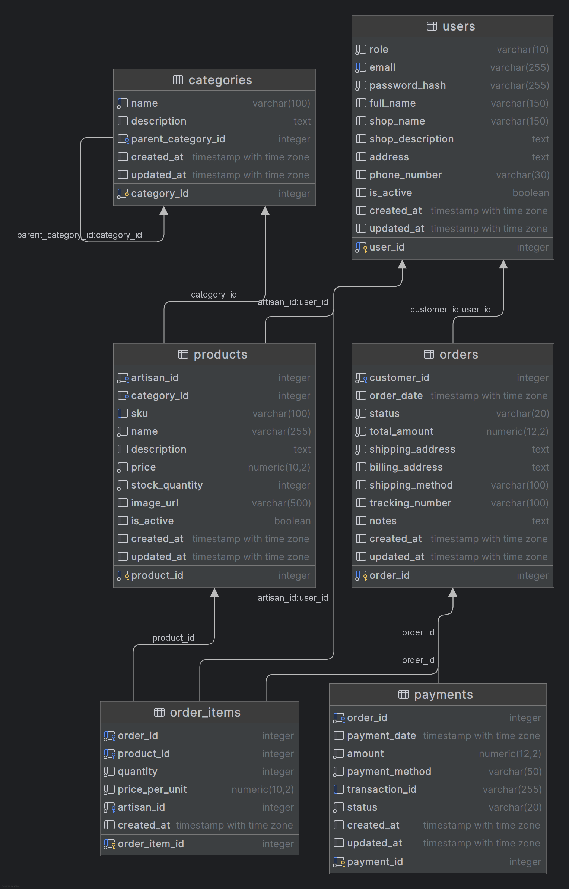

# Database - Artigianato Online
- Postgres (AKA PostgreSQL)

# IGNORARE QUESTI PASSAGGI! SEGUIRE LA DOCUMENTAZIONE NELLA WIKI!

### Installazione PostgreSQL (VPS Azure - Student Plan)

```BASH
sudo apt update && sudo apt install postgresql postgresql-contrib
sudo systemctl start postgresql.service

# Creare un utente (per la connessione al DB)
sudo -u postgres psql
CREATE USER artigianato WITH PASSWORD '<password>'; # Sostituisci <password> con una password sicura e salvarla in un file .env
\q

# SSL PostgreSQL
sudo snap install core; sudo snap refresh core
sudo snap install --classic certbot
sudo ln -s /snap/bin/certbot /usr/bin/certbot

# Creare A Record DNS su Cloudflare con Name: artigianatopsql e Content: <IP Pubblico VPS> e poi procedere
sudo certbot certonly --standalone -d artigianatopsql.dominio.tld # Sostituire dominio.tld con il proprio dominio

sudo -u postgres psql -U postgres -c 'SHOW data_directory'
sudo nano /etc/letsencrypt/renewal-hooks/deploy/postgresql.deploy
```

Inserire il seguente contenuto, sostituendo DOMAIN=artigianatopsql.dominio.tld con il proprio dominio, e DATA_DIR con il percorso di postgres (Solitamenmte basta cambiare "14" con la versione di postgres installata):
```TXT
 #!/bin/bash
 umask 0177
 DOMAIN=artigianatopsql.dominio.tld
 DATA_DIR=/var/lib/postgresql/14/main
 cp /etc/letsencrypt/live/$DOMAIN/fullchain.pem $DATA_DIR/server.crt
 cp /etc/letsencrypt/live/$DOMAIN/privkey.pem $DATA_DIR/server.key
 chown postgres:postgres $DATA_DIR/server.crt $DATA_DIR/server.key
```
CTRL+X per uscire, Y per salvare e invio per confermare.

```BASH
sudo chmod +x /etc/letsencrypt/renewal-hooks/deploy/postgresql.deploy

# Aprire config postgres, cambiare "14" con la versione di postgres installata
sudo nano /etc/postgresql/14/main/postgresql.conf
```
Modificare le opzioni SSL (in basso) come segue:
```TXT
 ssl = on  
 ssl_cert_file = 'server.crt'  
 ssl_key_file = 'server.key'  
 ssl_prefer_server_ciphers = on # Commentata, togliere il commento
 ```

Abilitare listen_addresses (prima di SSL, in alto), e mettere '*' e togliere commento:
```TXT
 listen_addresses = '*'
```
CTRL+X per uscire, Y per salvare e invio per confermare.

Modificare il file pg_hba.conf (sostituire 14 con la versione di postgres installata):
```BASH
sudo nano /etc/postgresql/14/main/pg_hba.conf
```

Aggiungere la seguente riga in fondo al file:
```TXT
hostssl all all 0.0.0.0/0 md5
```
CTRL+X per uscire, Y per salvare e invio per confermare.

Rinnovare i certificati per attivare l'hook, e riavviare postgres:
```BASH
sudo certbot renew --force-renewal
sudo service postgresql restart
```

Se si disattiva il proxy di Cloudflare (la nuvoletta arancione) è possibile connettersi al Database direttamente con il dominio
creato per il certificato SSL, altrimenti si dovrà usare l'IP pubblico della VPS.

Si consiglia la creazione un utente (eg: artigianoto) con password, con permesso di creazione database,
sarà utile per gli script del Backend:
```BASH
sudo -u postgres psql
CREATE USER artigianato WITH PASSWORD '<password>'; # Sostituire <password> con password sicura e salvarla in un file .env
ALTER USER artigianato CREATEDB;
```

# DB:

Schema:


Creazione:
```SQL
-- Tabelle --

-- Utenti
CREATE TABLE users (
    user_id SERIAL PRIMARY KEY,
    role VARCHAR(10) NOT NULL CHECK (role IN ('artigiano', 'cliente', 'admin')),
    email VARCHAR(255) NOT NULL UNIQUE,
    password_hash VARCHAR(255) NOT NULL,
    full_name VARCHAR(150),
    shop_name VARCHAR(150),
    shop_description TEXT,
    address TEXT,
    phone_number VARCHAR(30),
    is_active BOOLEAN DEFAULT TRUE,
    created_at TIMESTAMP WITH TIME ZONE DEFAULT CURRENT_TIMESTAMP,
    updated_at TIMESTAMP WITH TIME ZONE DEFAULT CURRENT_TIMESTAMP
);

-- Categorie Prodotti
CREATE TABLE categories (
    category_id SERIAL PRIMARY KEY,
    name VARCHAR(100) NOT NULL UNIQUE,
    description TEXT,
    parent_category_id INTEGER REFERENCES categories(category_id) ON DELETE SET NULL,
    created_at TIMESTAMP WITH TIME ZONE DEFAULT CURRENT_TIMESTAMP,
    updated_at TIMESTAMP WITH TIME ZONE DEFAULT CURRENT_TIMESTAMP
);

-- Prodotti
CREATE TABLE products (
    product_id SERIAL PRIMARY KEY,
    artisan_id INTEGER NOT NULL REFERENCES users(user_id) ON DELETE CASCADE,
    category_id INTEGER REFERENCES categories(category_id) ON DELETE SET NULL,
    sku VARCHAR(100) UNIQUE,
    name VARCHAR(255) NOT NULL,
    description TEXT,
    price NUMERIC(10, 2) NOT NULL CHECK (price >= 0),
    stock_quantity INTEGER NOT NULL DEFAULT 0 CHECK (stock_quantity >= 0),
    image_url VARCHAR(500),
    is_active BOOLEAN DEFAULT TRUE,
    created_at TIMESTAMP WITH TIME ZONE DEFAULT CURRENT_TIMESTAMP,
    updated_at TIMESTAMP WITH TIME ZONE DEFAULT CURRENT_TIMESTAMP
);

-- Ordini
CREATE TABLE orders (
    order_id SERIAL PRIMARY KEY,
    customer_id INTEGER NOT NULL REFERENCES users(user_id) ON DELETE RESTRICT,
    order_date TIMESTAMP WITH TIME ZONE DEFAULT CURRENT_TIMESTAMP,
    status VARCHAR(20) NOT NULL CHECK (status IN ('pending', 'paid', 'processing', 'shipped', 'delivered', 'cancelled', 'refunded')),
    total_amount NUMERIC(12, 2) NOT NULL CHECK (total_amount >= 0),
    shipping_address TEXT NOT NULL,
    billing_address TEXT,
    shipping_method VARCHAR(100),
    tracking_number VARCHAR(100),
    notes TEXT,
    created_at TIMESTAMP WITH TIME ZONE DEFAULT CURRENT_TIMESTAMP,
    updated_at TIMESTAMP WITH TIME ZONE DEFAULT CURRENT_TIMESTAMP
);

-- Elementi Ordine
CREATE TABLE order_items (
    order_item_id SERIAL PRIMARY KEY,
    order_id INTEGER NOT NULL REFERENCES orders(order_id) ON DELETE CASCADE,
    product_id INTEGER NOT NULL REFERENCES products(product_id) ON DELETE RESTRICT,
    quantity INTEGER NOT NULL CHECK (quantity > 0),
    price_per_unit NUMERIC(10, 2) NOT NULL CHECK (price_per_unit >= 0),
    artisan_id INTEGER NOT NULL REFERENCES users(user_id) ON DELETE RESTRICT,
    created_at TIMESTAMP WITH TIME ZONE DEFAULT CURRENT_TIMESTAMP,
    CONSTRAINT unique_order_product UNIQUE (order_id, product_id)
);

-- Pagamenti
CREATE TABLE payments (
    payment_id SERIAL PRIMARY KEY,
    order_id INTEGER NOT NULL UNIQUE REFERENCES orders(order_id) ON DELETE CASCADE,
    payment_date TIMESTAMP WITH TIME ZONE DEFAULT CURRENT_TIMESTAMP,
    amount NUMERIC(12, 2) NOT NULL CHECK (amount >= 0),
    payment_method VARCHAR(50) NOT NULL CHECK (payment_method IN ('credit_card', 'paypal', 'bank_transfer', 'other')),
    transaction_id VARCHAR(255) UNIQUE,
    status VARCHAR(20) NOT NULL CHECK (status IN ('pending', 'completed', 'failed', 'refunded')),
    created_at TIMESTAMP WITH TIME ZONE DEFAULT CURRENT_TIMESTAMP,
    updated_at TIMESTAMP WITH TIME ZONE DEFAULT CURRENT_TIMESTAMP
);

    
-- Funzioni -- 

-- Funzione per aggiornare updated_at
CREATE OR REPLACE FUNCTION trigger_set_timestamp()
RETURNS TRIGGER AS $$
BEGIN
  NEW.updated_at = NOW();
  RETURN NEW;
END;
$$ LANGUAGE plpgsql;
    
   
-- Triggers --

-- Triggers per aggiornare updated_at
CREATE TRIGGER set_timestamp_users
BEFORE UPDATE ON users
FOR EACH ROW
EXECUTE FUNCTION trigger_set_timestamp();

CREATE TRIGGER set_timestamp_categories
BEFORE UPDATE ON categories
FOR EACH ROW
EXECUTE FUNCTION trigger_set_timestamp();

CREATE TRIGGER set_timestamp_products
BEFORE UPDATE ON products
FOR EACH ROW
EXECUTE FUNCTION trigger_set_timestamp();

CREATE TRIGGER set_timestamp_orders
BEFORE UPDATE ON orders
FOR EACH ROW
EXECUTE FUNCTION trigger_set_timestamp();

CREATE TRIGGER set_timestamp_payments
BEFORE UPDATE ON payments
FOR EACH ROW
EXECUTE FUNCTION trigger_set_timestamp();
```